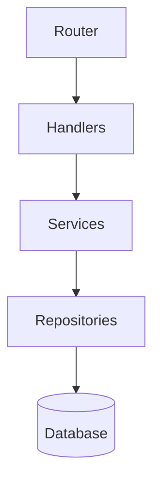

# Project X-Ray

Scan a codebase end-to-end and produce a single markdown file — `PROJECT_ANALYSIS.md` — that answers the questions a newcomer (human or agent) would otherwise spend an hour piecing together: what does this project do, how is it built, where does everything live, and what conventions does the team follow?

The skill exists because agents dropped into an unfamiliar repo waste context window rediscovering the same facts — directory layout, framework version, test runner, naming conventions — on every session. A one-time x-ray run captures that context durably so subsequent sessions can load it instead of re-scanning.

## When to use this skill

- The user asks to analyze, scan, or map a project.
- The user asks "what does this project do?" or wants an onboarding overview.
- An agent is starting work in a repo it has never seen and needs fast orientation.
- The user wants a written snapshot of the project state before a large refactor or handoff.

## Phase 1: Structure scan

Walk the project directory tree, respecting `.gitignore` and skipping generated/vendored directories (`node_modules`, `dist`, `build`, `.git`, `__pycache__`, `target`, `vendor`, `.next`). Produce:

1. **Top-level tree** — every root-level file and directory with a one-line purpose annotation.
2. **Depth-limited expansion** — expand key directories (src, lib, app, packages, cmd, internal) to 2-3 levels to show the organizational shape without flooding the output.
3. **Entry points** — identify main entry files: `main.go`, `index.ts`, `app.py`, `Program.cs`, `Main.java`, `Cargo.toml [[bin]]`, `package.json#main`, etc.
4. **Monorepo detection** — check for `workspaces` in package.json, `pnpm-workspace.yaml`, `Cargo.toml [workspace]`, `go.work`, `lerna.json`, `nx.json`. If detected, list the packages/apps with one-line descriptions.

## Phase 2: Dependency & toolchain inventory

Detect the project's ecosystem from manifest and config files:

| Signal | What to extract |
|---|---|
| `package.json` / `pnpm-lock.yaml` / `yarn.lock` / `package-lock.json` | Runtime, framework, key deps grouped by role (framework, data, HTTP, auth, test, dev tooling). Node version from `.nvmrc` / `engines`. |
| `pyproject.toml` / `requirements.txt` / `Pipfile` / `setup.py` | Python version, framework (Django/Flask/FastAPI/…), key libraries. |
| `Cargo.toml` / `Cargo.lock` | Rust edition, key crates, workspace members. |
| `go.mod` / `go.sum` | Go version, key modules. |
| `*.csproj` / `*.sln` / `Directory.Build.props` | .NET version, target framework, NuGet packages. |
| `build.gradle` / `pom.xml` | Java/Kotlin version, Spring Boot version, key dependencies. |
| `Gemfile` / `Gemfile.lock` | Ruby version, Rails version, key gems. |
| `composer.json` | PHP version, Laravel/Symfony version, key packages. |

Also detect build tooling (webpack, vite, esbuild, tsc, cargo, make, cmake, gradle, maven, msbuild), test runner (jest, vitest, pytest, go test, cargo test, xunit, junit), and linter/formatter (eslint, prettier, ruff, black, clippy, rustfmt, gofmt, checkstyle).

Group dependencies by role, not alphabetically. A reader should see "these are the data-access libs, these are the test libs" at a glance.

## Phase 3: Architecture mapping

Identify the architectural shape by examining directory layout, import patterns, and framework conventions:

1. **Pattern classification** — Determine the dominant pattern: MVC, layered (handler → service → repository), hexagonal/ports-and-adapters, microservices (multiple deploy units), CLI tool, library/SDK, monolith, serverless functions, plugin system, pipeline/ETL. State which one and cite the directory structure or code patterns that reveal it.
2. **Module map** — List the major modules/packages/namespaces and their single-sentence responsibility.
3. **Data flow** — Describe how a request/command flows through the system. Example: "HTTP request → router → handler → service → repository → Postgres."
4. **Boundaries** — Note any clear boundary enforcement: separate packages, interface layers, dependency injection, API versioning.
5. **Mermaid diagram** (optional) — When the project has ≤15 major modules and the relationships are non-trivial, include a mermaid graph showing the dependency/data-flow direction. Skip if the project is too large for the diagram to be readable, or if the architecture is flat enough that a diagram adds nothing.



## Phase 4: Convention extraction

Scan configuration files and code samples to extract the team's conventions:

- **Code style** — Indentation (tabs/spaces/size), naming convention (camelCase, snake_case, PascalCase for types), file naming pattern (kebab-case, PascalCase, snake_case).
- **Commit conventions** — Check for `.commitlintrc`, commit message patterns in recent history, conventional commits (`feat:`, `fix:`, etc.).
- **Branching model** — Check for branch protection config, common branch names (main/master/develop), PR templates.
- **CI/CD** — Detect `.github/workflows/`, `.gitlab-ci.yml`, `Jenkinsfile`, `.circleci/`, `bitbucket-pipelines.yml`, `azure-pipelines.yml`. Summarize what the pipeline does (lint, test, build, deploy) without dumping full YAML.
- **Documentation** — Note existing docs: README, CONTRIBUTING, CHANGELOG, ADRs (`docs/adr/`), API docs, OpenAPI/Swagger specs.
- **Agent instruction files** — Flag any files meant for AI agents: `CLAUDE.md`, `AGENTS.md`, `.cursorrules`, `.github/copilot-instructions.md`, `GEMINI.md`. Note their existence and one-line summary of what they instruct.

## Phase 5: Domain summary

Write 2-4 paragraphs that describe what the project **does** in plain language:

- What problem does it solve and for whom?
- What are the core domain concepts / entities?
- What are the primary user-facing features or API surfaces?
- How is the project deployed or consumed (npm package, Docker container, CLI binary, web app, mobile app, library)?

Ground every claim in evidence: README content, code comments, route definitions, exported functions, CLI help text, test descriptions. Do not speculate beyond what the code shows — put genuine unknowns in the Open Questions section.

## Output format

Write the analysis to `PROJECT_ANALYSIS.md` in the repository root (or another path if the user specifies one). Use this structure:

```markdown
# Project Analysis: {project name}

> Generated by project-x-ray · {YYYY-MM-DD}

## Overview

{Phase 5 domain summary — 2-4 paragraphs}

## Directory Structure

{Phase 1 annotated tree + entry points}

## Tech Stack & Dependencies

{Phase 2 ecosystem, versions, grouped deps, build/test/lint tooling}

## Architecture

{Phase 3 pattern, module map, data flow, optional mermaid diagram}

## Conventions & Tooling

{Phase 4 code style, commits, CI/CD, docs, agent files}

## Open Questions

{Things the scan couldn't determine — missing docs, ambiguous patterns,
 decisions that need a human to clarify}
```

If `PROJECT_ANALYSIS.md` already exists, overwrite it — the file is a point-in-time snapshot, not a log. Tell the user what you wrote and where.

## Boundaries

- **Report, don't judge.** The x-ray describes what is; it does not rate code quality, suggest refactors, or prescribe changes. That's a different skill.
- **No secrets.** Note the existence of `.env`, `.env.local`, secrets directories, vault configs — but never read or reproduce their contents.
- **Respect .gitignore.** If a directory is gitignored, skip it. Generated and vendored code is noise, not signal.
- **Open questions are honest.** If the scan can't determine something (e.g., deploy target, database choice when there's no config), say so in the Open Questions section. Don't invent answers.
- **Stay scoped.** The output is one file. Don't create multiple analysis files, rewrite the README, or start modifying the project. The x-ray is read-only.
